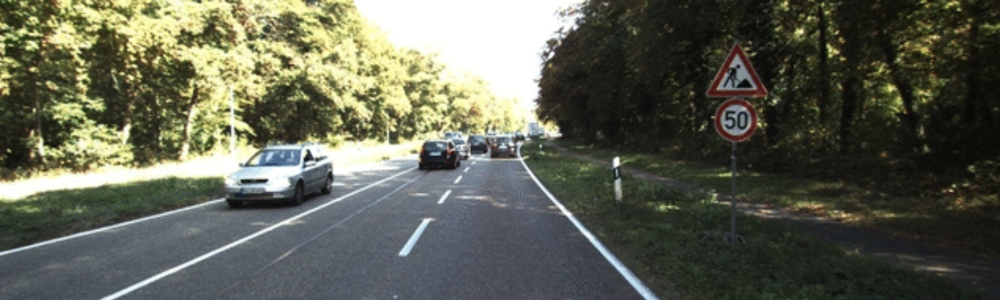
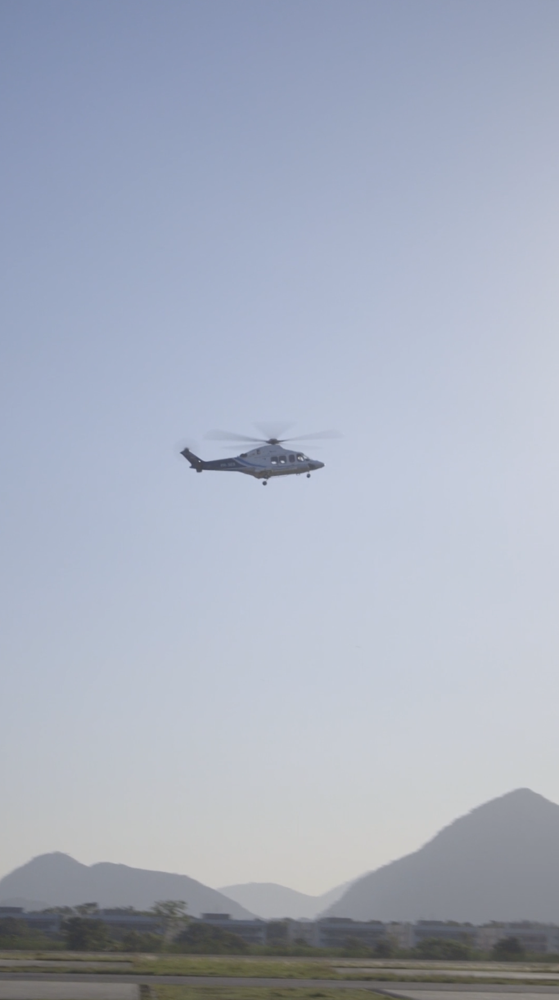
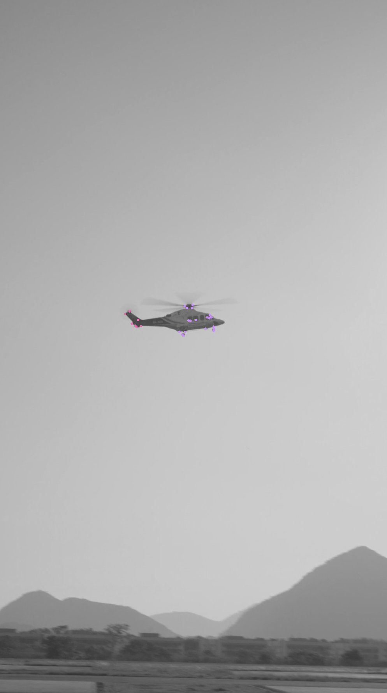
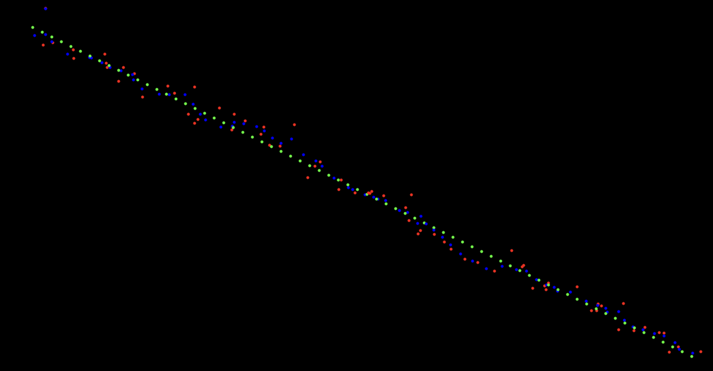

# Optimal Drone Navigation Based on Visual Obstacle Analysis

Authors (team): [Anastasiia Pelekh](https://github.com/Drakonchyk), [Ksenia Kretsula](https://github.com/kretsulaksusha).

## Description

Autonomous drone navigation presents significant challenges, particularly in environments with complex obstacles and limited sensing capabilities. This research explores a conceptual system for real-time obstacle detection and avoidance using only a single onboard camera. Our approach leverages monocular vision combined with feature point detection to estimate depth and identify obstacles dynamically. By applying advanced computer vision techniques, the system processes visual input to detect, classify, and respond to obstacles in real time, enabling intelligent navigation based purely on visual data. This theoretical framework provides insights into the feasibility and potential of vision-based drone navigation without reliance on additional hardware sensors.

## Prerequisites

- GCC
- CMake
- CV

### Installation

```shell
git clone https://github.com/kretsulaksusha/drove_navigation.git
cd drove_navigation
```

### Compilation

```shell
./compile.sh -R
```

### Usage

Create directory `models` and download the model: [Midas GitHub: model-small.onnx](https://github.com/isl-org/MiDaS/releases/download/v2_1/model-small.onnx) for depth estimation.

```shell
mkdir -p models
wget -P ./models https://github.com/isl-org/MiDaS/releases/download/v2_1/model-small.onnx
```

Then you can run test programs with the following commands:

```shell
./bin/test_depth_estimation
./bin/test_fast_detector
./bin/test_kalman
```

Also, you can put an image in `./media` directory and run 2 test programs with the following command:

```shell
./bin/test_depth_estimation your_image.png
./bin/test_fast_detector your_image.png
```

To run the main program, you need to have a video file with a drone flight. You can use the provided video `./media/helicopter.mp4` or any other video file.
The program will process the video, display the results in real time and save it in `./media/results` directory.

```shell
./bin/drone_navigation
```

### Results

Testing programs will display the results in real time and save them in `./media/results` directory.

```shell
./bin/test_depth_estimation
```




```shell
./bin/test_fast_detector
```

<div style="display: flex; justify-content: space-between;">
  
  
</div>

```shell
./bin/test_kalman
```



Terminal output of the program:

```text
Step: 0 | Measured: (1.23068, 1.39133) | Predicted: (1.22456, 1.38441) | True: (1, 0.5)
Step: 1 | Measured: (2.36511, -1.48654) | Predicted: (2.35519, -1.41965) | True: (2, 1)
...
Step: 68 | Measured: (67.6759, 34.5882) | Predicted: (68.7148, 34.2501) | True: (69, 34.5)
Step: 69 | Measured: (70.9529, 34.5167) | Predicted: (70.1051, 34.672) | True: (70, 35)
```

---

The results of the main program are saved in `./media/video_results` directory.

### Sources

#### Feature Detection

- [Introduction to Feature Detection and Matching](https://medium.com/@deepanshut041/introduction-to-feature-detection-and-matching-65e27179885d)
- [Feature Detection Lecture PDF](https://courses.cs.washington.edu/courses/cse455/09wi/Lects/lect6.pdf)
- [Feature Detection Documentation](https://docs.labforge.ca/docs/feature-detection)

#### FAST

- [Tracking Objects with FAST Algorithm using OpenCV](https://medium.com/@siromermer/tracking-objects-with-fast-algorithm-using-opencv-dea6dab97825)
- [YouTube Video: FAST Object Tracking](https://youtu.be/Vqtf0iVUqHg?si=NOiabShAzBl20tmp)
- [OpenCV FAST Feature Detector Documentation](https://docs.opencv.org/3.4/df/d74/classcv_1_1FastFeatureDetector.html)
- [Introduction to FAST Features from Accelerated Segment Test](https://medium.com/@deepanshut041/introduction-to-fast-features-from-accelerated-segment-test-4ed33dde6d65)
- [Feature from Accelerated Segment Test PDF](https://homepages.inf.ed.ac.uk/rbf/CVonline/LOCAL_COPIES/AV1011/AV1FeaturefromAcceleratedSegmentTest.pdf)
- [Predicting Objects Motion with Kalman Filter and FAST Algorithm](https://medium.com/@siromermer/predicting-objects-motion-with-kalman-filter-and-fast-algorithm-2278c551670b)
- [SIFT vs ORB vs FAST: Performance Comparison of Feature Extraction Algorithms](https://medium.com/@siromermer/sift-vs-orb-vs-fast-performance-comparison-of-feature-extraction-algorithms-d8993c977677)
- [Source Code for SIFT, ORB, FAST, and FFME for OpenCV](https://marcosnietoblog.wordpress.com/2012/07/15/source-code-for-sift-orb-fast-and-ffme-for-opencv-c-for-egomotion-estimation/)

#### **Corner Detection**

- [YouTube Video: Corner Detection](https://youtu.be/pDImLazOPrQ?si=OfXoVjzBjRINFQy-)

#### **Papers**

- [IEEE Paper: Tracking with Kalman Filter](https://ieeexplore.ieee.org/document/8594299)
- [Arxiv Paper: Feature Detection](https://arxiv.org/pdf/1610.06475)
- [Photo Tourism Paper](https://phototour.cs.washington.edu/Photo_Tourism.pdf)
- [ORB: An Efficient Alternative to SIFT or SURF](https://sites.cc.gatech.edu/classes/AY2024/cs4475_summer/images/ORB_an_efficient_alternative_to_SIFT_or_SURF.pdf)
- [Arxiv Paper on Feature Detection](https://arxiv.org/pdf/2302.12288)
