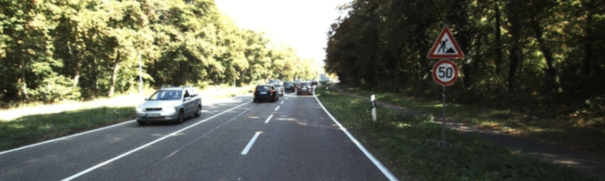
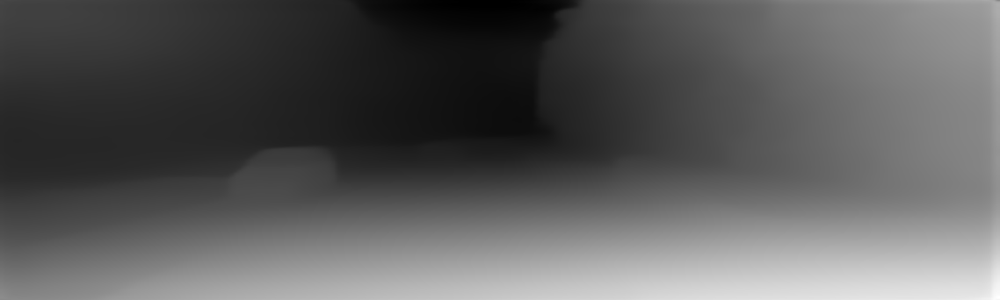
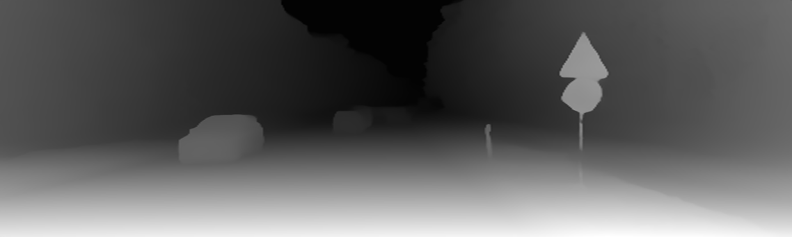
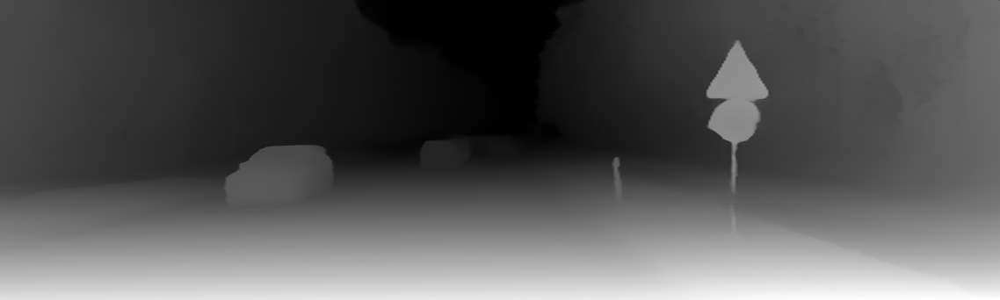
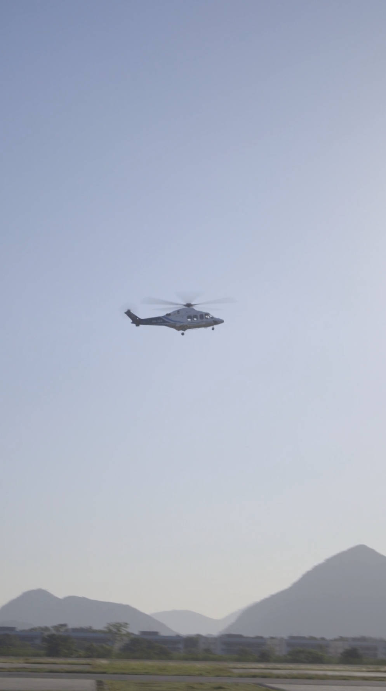
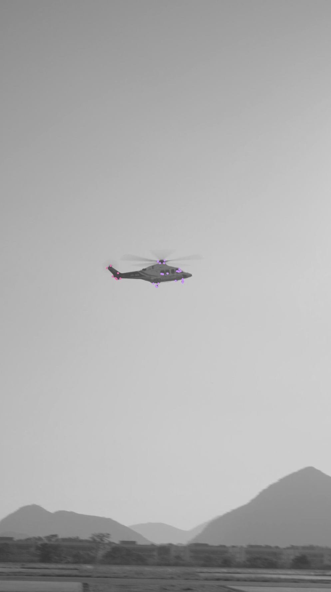
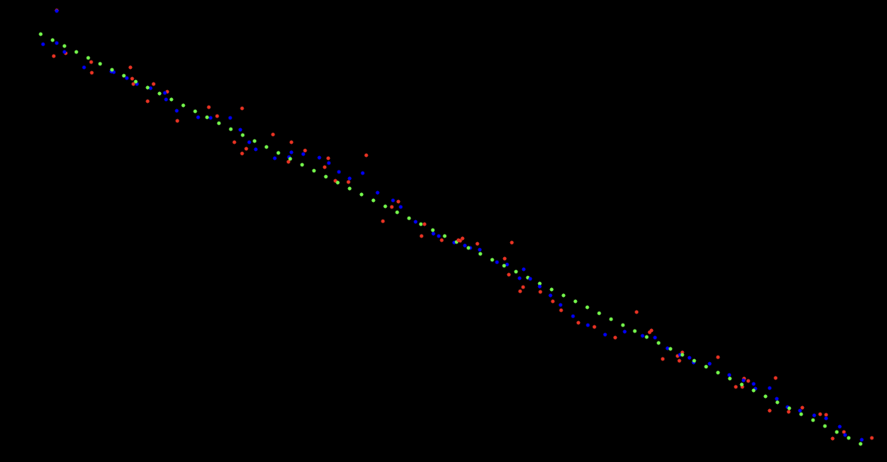

# Drone Navigation Based on Visual Obstacle Analysis

Authors (team): [Anastasiia Pelekh](https://github.com/Drakonchyk), [Ksenia Kretsula](https://github.com/kretsulaksusha).

## Overview

Autonomous navigation for drones in environments with complex obstacles and limited sensing capabilities remains a significant challenge. This project presents a conceptual real-time obstacle detection and avoidance system based solely on a single onboard monocular camera.

The system combines feature point detection with depth estimation models to dynamically interpret spatial information, enabling vision-only navigation. Theoretical and practical insights are provided into the design and performance of a lightweight, sensor-free drone navigation framework.

### Features

- Real-time depth estimation using monocular vision
- Feature detection using FAST algorithm
- Kalman filter for motion prediction
- Support for multiple ONNX-based depth models
- Visual results and performance logging

## Table of Contents

- [Overview](#overview)
  - [Features](#features)
- [Table of Contents](#table-of-contents)
- [Prerequisites](#prerequisites)
- [Installation](#installation)
  - [Compilation](#compilation)
- [Model Setup](#model-setup)
  - [Model Downloads](#model-downloads)
- [Usage](#usage)
  - [Running tests](#running-tests)
  - [With Custom Image Input](#with-custom-image-input)
  - [Running Main Program](#running-main-program)
- [Results](#results)
- [Sources](#sources)

## Prerequisites

- GCC
- CMake
- OpenCV

## Installation

```shell
git clone https://github.com/kretsulaksusha/drove_navigation.git
cd drove_navigation
```

### Compilation

```shell
./compile.sh -R
```

## Model Setup

Create a directory called `models` and download the necessary ONNX models for depth estimation.

Model Comparison (Small Versions):

| Metric             | MiDaS                | Depth Anything V2 | Distill Any Depth |
|--------------------|----------------------|-------------------|-------------------|
| **Model Size**     | \~66.8 MB            | \~99.4 MB         | \~99.2 MB         |
| **FPS**            | \~20-25 FPS          | \~N FPS           | \~N FPS           |
| **Inference Time** | \~40-50 ms per frame | \~N ms per frame  | \~N ms per frame  |

### Model Downloads

- [Midas GitHub: `model-small.onnx`](https://github.com/isl-org/MiDaS/releases/download/v2_1/model-small.onnx)
- [Depth Anything V2: `depth_anything_v2_vits.onnx`](https://github.com/fabio-sim/Depth-Anything-ONNX/releases)

```shell
mkdir -p models
wget -P ./models https://github.com/isl-org/MiDaS/releases/download/v2_1/model-small.onnx
wget -P ./models https://github.com/fabio-sim/Depth-Anything-ONNX/releases/download/v2.0.0/depth_anything_v2_vits.onnx
```

For [Distill Any Depth](https://distill-any-depth-official.github.io/) use a python script to convert the model to ONNX format. You can find the script in the `./scripts` directory.

```shell
# Install the required Python packages
pip install -r requirements.txt

# Run the script to convert the model
python3 scripts/distill_any_depth_to_onnx.py
```

## Usage

### Running tests

```shell
./bin/test_depth_estimation
./bin/test_fast_detector
./bin/test_kalman
```

### With Custom Image Input

Place an image in `./media` and run:

```shell
./bin/test_depth_estimation your_image.png
./bin/test_fast_detector your_image.png
```

### Running Main Program

To analyze video footage, use the provided sample (`./media/helicopter.mp4`) or your own:

```shell
./bin/drone_navigation
```

The result will be displayed in real-time and saved in `./media/video_results` directory.

## Results

Testing programs will display the results in real time and save them in `./media/depth_estimation_results` directory.

```shell
./bin/test_depth_estimation
```


MiDaS (color):

MiDaS (grayscale):

Depth Anything V2:

Distill Any Depth:


The results above showcase outputs from all supported models. However, by default, the command will generate a depth map using only the **Distill Any Depth** model.

To use a different model, you can modify the configuration in the `./src/depth_estimation.cpp` file.

```shell
./bin/drone_navigation
```

<div style="display: flex; justify-content: space-between;">
  
  
</div>

```shell
./bin/test_kalman
```



Terminal output of the program:

```text
Step: 0 | Measured: (1.23068, 1.39133) | Predicted: (1.22456, 1.38441) | True: (1, 0.5)
Step: 1 | Measured: (2.36511, -1.48654) | Predicted: (2.35519, -1.41965) | True: (2, 1)
...
Step: 68 | Measured: (67.6759, 34.5882) | Predicted: (68.7148, 34.2501) | True: (69, 34.5)
Step: 69 | Measured: (70.9529, 34.5167) | Predicted: (70.1051, 34.672) | True: (70, 35)
```

---

The results of the main program are saved in `./media/video_results` directory.

### Sources

#### Feature Detection

- [Introduction to Feature Detection and Matching](https://medium.com/@deepanshut041/introduction-to-feature-detection-and-matching-65e27179885d)
- [Feature Detection Lecture PDF](https://courses.cs.washington.edu/courses/cse455/09wi/Lects/lect6.pdf)
- [Feature Detection Documentation](https://docs.labforge.ca/docs/feature-detection)

#### FAST

- [Tracking Objects with FAST Algorithm using OpenCV](https://medium.com/@siromermer/tracking-objects-with-fast-algorithm-using-opencv-dea6dab97825)
- [YouTube Video: FAST Object Tracking](https://youtu.be/Vqtf0iVUqHg?si=NOiabShAzBl20tmp)
- [OpenCV FAST Feature Detector Documentation](https://docs.opencv.org/3.4/df/d74/classcv_1_1FastFeatureDetector.html)
- [Introduction to FAST Features from Accelerated Segment Test](https://medium.com/@deepanshut041/introduction-to-fast-features-from-accelerated-segment-test-4ed33dde6d65)
- [Feature from Accelerated Segment Test PDF](https://homepages.inf.ed.ac.uk/rbf/CVonline/LOCAL_COPIES/AV1011/AV1FeaturefromAcceleratedSegmentTest.pdf)
- [Predicting Objects Motion with Kalman Filter and FAST Algorithm](https://medium.com/@siromermer/predicting-objects-motion-with-kalman-filter-and-fast-algorithm-2278c551670b)
- [SIFT vs ORB vs FAST: Performance Comparison of Feature Extraction Algorithms](https://medium.com/@siromermer/sift-vs-orb-vs-fast-performance-comparison-of-feature-extraction-algorithms-d8993c977677)
- [Source Code for SIFT, ORB, FAST, and FFME for OpenCV](https://marcosnietoblog.wordpress.com/2012/07/15/source-code-for-sift-orb-fast-and-ffme-for-opencv-c-for-egomotion-estimation/)

#### **Corner Detection**

- [YouTube Video: Corner Detection](https://youtu.be/pDImLazOPrQ?si=OfXoVjzBjRINFQy-)

#### **Papers**

- [IEEE Paper: Tracking with Kalman Filter](https://ieeexplore.ieee.org/document/8594299)
- [Arxiv Paper: Feature Detection](https://arxiv.org/pdf/1610.06475)
- [Photo Tourism Paper](https://phototour.cs.washington.edu/Photo_Tourism.pdf)
- [ORB: An Efficient Alternative to SIFT or SURF](https://sites.cc.gatech.edu/classes/AY2024/cs4475_summer/images/ORB_an_efficient_alternative_to_SIFT_or_SURF.pdf)
- [Arxiv Paper on Feature Detection](https://arxiv.org/pdf/2302.12288)
